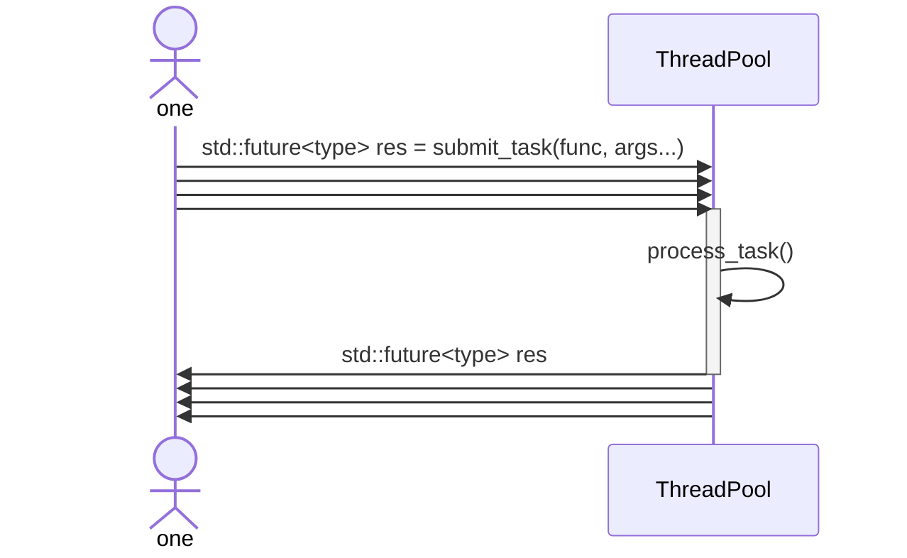

# ThreadPool ⚡

<p align="center">
  <strong>一个轻量的 C++11 通用线程池组件</strong><br />
  支持有界队列、异步任务提交与 Future 返回值获取、优先级任务调度和可选自动扩缩容。
</p>

<p align="center">
  
  
  
  
</p>

<p align="center">
  <a href="#quick-start">🚀 快速开始</a> ·
  <a href="#integration">🧩 快速集成</a> ·
  <a href="#features">✨ 功能特性</a> ·
  <a href="#build-and-test">🛠️ 构建与测试</a>
</p>

小而专注：当前仓库只提供 `ThreadPool` CMake target。可使用 CMake 通过 `FetchContent` 快速集成当前库到项目中，作为 `FetchContent` 子项目引入时，只暴露 `ThreadPool` target，不会自动构建 [examples](examples/) 或 [test](test/)。



<a id="quick-start"></a>

## 快速开始 🚀

构造参数：

```cpp
ThreadPool(int threadCount = 1,
           int queueCapacity = 50,
           bool autoScalingEnabled = false,
           int waitTimeoutMs = 1000);
```

> [!TIP]
> 当 `autoScalingEnabled` 为 `true` 时，队列满且等待超过 `waitTimeoutMs` 会尝试扩容；worker 空闲超过 `waitTimeoutMs` 会尝试缩容。线程池最少保留 `1` 个 worker。
>
> `waitTimeoutMs` 同时影响扩容和缩容的触发敏感度：值越小，线程池越快响应队列满或 worker 空闲；值越大，线程池越稳定，但扩缩容响应更慢。

使用示例（详细见 [examples/](examples/)）：

```cpp
#include "ThreadPool.h"

#include <future>
#include <iostream>

int main() {
    int initialSize = 4;
    wxm::ThreadPool pool(initialSize, 64, false, 1000);

    std::future<int> result = pool.submit_task([](int left, int right) {
        return left * right;
    }, 6, 7);

    std::cout << result.get() << std::endl; // 42
    return 0;
}
```

带优先级任务也很直接。优先级数值越大，越先被调度；同优先级任务按提交顺序 FIFO 执行。

```cpp
std::future<int> highPriorityTask = pool.submit_task(10, []() {
    return 100;
});
```

如果任务内部抛出异常，异常会通过 `future.get()` 传播给调用方。

```cpp
std::future<void> failed = pool.submit_task([]() {
    throw std::runtime_error("task failed");
});

failed.get(); // throws std::runtime_error
```

<a id="integration"></a>

## 快速集成 🧩

本地开发时可以直接指向这个 checkout：

```cmake
include(FetchContent)

FetchContent_Declare(
    ThreadPool
    SOURCE_DIR "/path/to/ThreadPool"
)
FetchContent_MakeAvailable(ThreadPool)

target_link_libraries(your_target PRIVATE ThreadPool)
```

发布到 Git 仓库后，可以换成远程仓库地址：

```cmake
include(FetchContent)

FetchContent_Declare(
    ThreadPool
    GIT_REPOSITORY https://github.com/WenXingming/ThreadPool.git
)
FetchContent_MakeAvailable(ThreadPool)

target_link_libraries(your_target PRIVATE ThreadPool)
```

<a id="features"></a>

## 功能特性 ✨

| 能力 | 说明 |
| --- | --- |
| 有界任务队列 | 队列满时提交线程等待，形成自然背压 |
| Future 返回值 | `submit_task()` 返回 `std::future<T>` |
| 优先级调度 | 支持 `int` 优先级，数值越大越先执行 |
| 同优先级 FIFO | 同优先级任务按提交顺序执行 |
| 异常传播 | 任务异常会在 `future.get()` 时重新抛出 |
| 优雅析构 | 析构时停止接收新任务，并等待已提交任务完成 |
| 自动扩缩容 | 可选启用，按队列压力和 worker 空闲情况调整线程数 |

<a id="build-and-test"></a>

## 构建与测试 🛠️

```bash
cmake -S . -B build
cmake --build build
ctest --test-dir build --output-on-failure
```

默认会构建线程池库、示例和线程池单元测试。作为 `FetchContent` 子项目引入时，只会暴露 `ThreadPool` target，不会自动构建 [examples/](examples/) 或 [test/](test/)。
