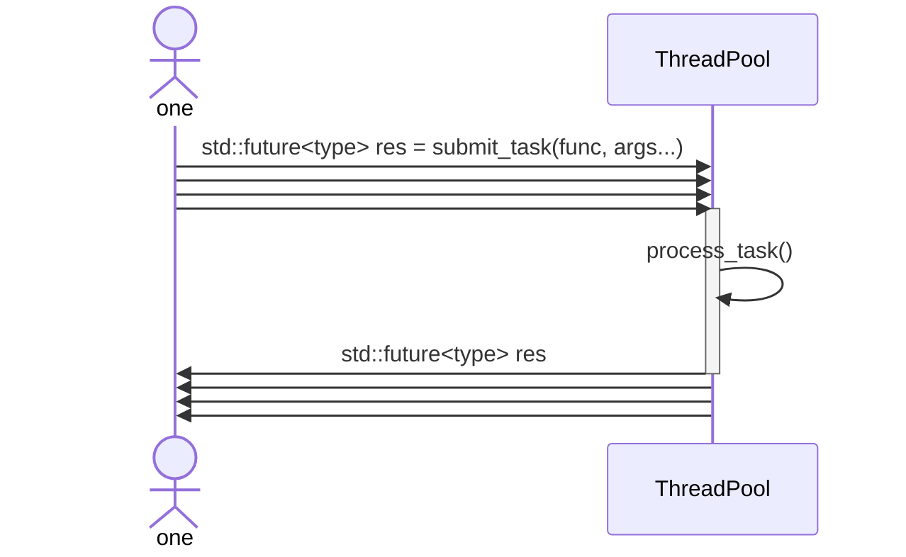

# C++ 通用线程池

一个基于 C++11 实现的通用线程池组件，支持有界任务队列、异步任务提交、`std::future` 结果获取、优先级调度和可选自动扩缩容。



使用示例详见 [examples/example.cpp](examples/example.cpp)，单元测试位于 [test](test) 目录。

## 快速使用

创建线程池后，可以提交任意可调用对象。无显式优先级时，任务默认优先级为 `0`。

```cpp
int initialSize = 3;
wxm::ThreadPool pool(initialSize, 32, false, 1000);

std::future<int> result = pool.submit_task([](int left, int right) {
    return left * right;
}, 6, 7);

std::cout << result.get() << std::endl;
```

也可以提交带优先级的任务。优先级数值越大，越先被调度；同优先级任务按提交顺序 FIFO 调度。

```cpp
std::future<int> highPriorityTask = pool.submit_task(10, []() {
    return 100;
});
```

如果任务内部抛出异常，异常会通过 `future.get()` 传播给调用方。

```cpp
std::future<void> failed = pool.submit_task([]() {
    throw std::runtime_error("task failed");
});

failed.get(); // throws std::runtime_error
```

## 功能特性

- **有界任务队列**：队列满时，提交线程会等待队列释放空间，形成背压。
- **异步任务提交**：支持任意可调用对象，并通过 `std::future` 获取返回值。
- **优先级调度**：任务可指定 `int` 优先级，数值越大越先被调度。
- **同优先级 FIFO**：同优先级任务使用递增入队序号保证提交顺序。
- **优雅析构**：析构时停止接收新任务，并等待已提交任务执行完成。
- **可选自动扩缩容**：可通过构造参数或接口启用/关闭自动扩缩容。
- **多生产者提交**：支持多个外部线程并发调用 `submit_task()`。
- **异常传播**：任务内部异常由 `std::packaged_task` 保存，并在 `future.get()` 时重新抛出。


## 自动扩缩容语义

构造函数参数如下：

```cpp
ThreadPool(int threadCount = 1,
           int maxTasksSize = 50,
           bool openAutoExpandReduce = false,
           int maxWaitTimeMs = 1000);
```

当 `openAutoExpandReduce` 为 `true` 时：

- 如果任务队列已满，提交线程等待超过 `maxWaitTimeMs` 后，线程池会尝试扩容。
- 如果 worker 在 `maxWaitTimeMs` 内没有等到任务，线程池会尝试缩容。
- 线程池最小保留 `1` 个 worker。
- 线程池最大扩展到 `2 * std::thread::hardware_concurrency()`。
- 缩容线程会自然退出并被安全 `join`，不会使用 `detach()`。

自动扩缩容也可以通过接口控制：

```cpp
pool.enable_auto_scaling();
pool.disable_auto_scaling();
```

>[!NOTE]
**理论上期望处理速率 $\mathrm{ Expect(v) \geq (1/\\_maxWaitTime) \times numOfThread }$（单位：任务/秒）**，其中 $\mathrm{numOfThread}$ 为**提交任务的并发线程数量**。
>- 若当前线程池无法达到该速率，其会自动扩容直到满足该速率或直至线程数量达到 2* 最大核心数。若扩容到 2* 最大核心数也达不到期望速率，此时属于硬件性能受限，线程池将维持在 2* 最大核心数。
>- 若当前线程池超过该速率，其会自动缩容直到满足该速率或直至线程数量达到 1。若缩容到 1 也超过期望速率，此时属于任务处理时间过短，线程池将维持在 1。

## 参数校验

`maxTasksSize` 和 `maxWaitTimeMs` 必须为正数，否则抛出 `std::invalid_argument`。

```cpp
wxm::ThreadPool pool(1, 16, false, 1000);
pool.set_queue_capacity(64);
pool.set_wait_timeout_ms(500);
```

## 测试覆盖

当前测试覆盖：

- 任务执行与空任务异常；
- 优先级调度与同优先级 FIFO；
- 返回值获取与异常传播；
- 任务异常后 worker 继续处理后续任务；
- 有界队列背压；
- 多生产者并发提交；
- 析构时执行完已提交任务；
- 析构时唤醒阻塞提交线程；
- 自动扩容、自动缩容以及开关控制；
- 配置参数合法/非法路径。

运行测试：

```bash
cmake --build build
ctest --test-dir build --output-on-failure
```

## 说明

本项目当前保持 C++11 标准，核心库默认不向 stdout/stderr 打印日志，适合作为后续并行压缩器等上层工具的任务调度组件。
