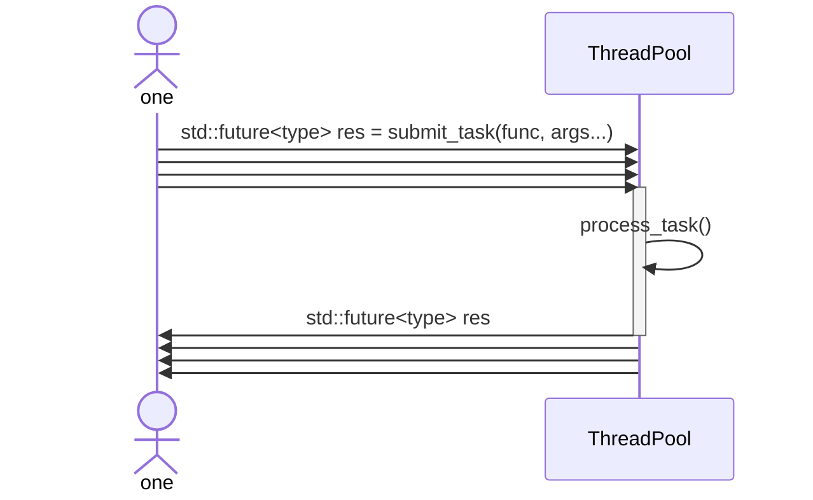

# C++ 通用线程池



一个简单实用的线程池，**使用示例详见 examples/example.cpp**，单元测试位于 test 目录。 该线程池具有以下特性：

1. **使用简单便捷**。只需在需要的地方包含 `ThreadPool.h` 头文件即可。通过 `wxm::ThreadPool pool;`（可指定构造函数参数）创建线程池后，即可提交任务。无参无返回值任务的提交示例：
    ```C++
    int initialSize = 2;
    wxm::ThreadPool pool(initialSize, 50, false, 1000);
    try {
        for (int i = 0; i < Task::taskNum; ++i) {
            pool.submit_task(&TestTask::task_1);
        }
    }
    catch (const std::exception& e) {
        std::cerr << e.what() << std::endl;
    }
    ```

    带返回值任务的提交示例：

    ```C++
    int initialSize = 3;
    wxm::ThreadPool pool(initialSize, 50, false, 1000);
    std::future<int> result = pool.submit_task([](int left, int right) {
        return left * right;
    }, 6, 7);
    std::cout << result.get() << std::endl;
    ```

2. **支持任何任务的异步执行和结果获取**。可执行任意类型的任务，并通过 `std::future` 异步获取任务返回值。

3. **支持线程池自动伸缩**。通过构造函数参数 `_maxWaitTime` 设定期望的任务处理速率，线程池将据此自动调整线程数量以满足性能需求。具体解释如下：

   - **理论上期望处理速率 $\mathrm{ Expect(v) \geq (1/\\_maxWaitTime) \times numOfThread }$（单位：任务/秒）**，其中 $\mathrm{numOfThread}$ 为**提交任务的线程数量**（非线程池大小）。若当前线程池无法达到该速率，其会自动扩容直到满足该速率或直至线程数量达到2* 最大核心数。若扩容到2* 最大核心数也达不到期望速率，此时属于硬件性能受限，线程池将维持在2* 最大核心数。

     **举例**：若期望每秒处理 5 个任务，且仅有一个任务提交线程，则 $\mathrm{5 = (1/\\_maxWaitTime) \times 1}$，可计算得 $\mathrm{\\_maxWaitTime = 0.2\ s = 200\ ms}$。

   - **理论上实际处理速率 $\mathrm{ Real(v) \geq (1/\\_maxWaitTime) \times numOfThreads}$（单位：任务/秒）**，其中 $\mathrm{numOfThreads}$ 为**线程池中线程数量**。若线程池处理能力超出任务提交速率，线程池将自动缩减线程数量，直到线程池大小达到满足 $\mathrm{E(v)}$ 条件下线程池大小的下界。。

   通常逻辑是，用户设想一个预期处理速率（单位：任务/秒），然后计算并设置 `_maxWaitTime`。若任务执行时间较长导致实际任务处理速率低于预期，线程池将自动扩容直至满足要求或达到2* 最大核心数；若线程池处理能力超出任务提交速率，线程池将自动缩减线程数量。

4. **支持优先级调度**。向线程池提交任务时可指定任务优先级（int 类型），数值越大优先级越高；不传入任务的优先级则优先级统一默认为 0。线程池将根据任务队列中任务的优先级进行调度（**若不设置任务优先级，即任务优先级相同为 0，此时默认 FCFS 调度**）。用户可将优先级视为任务等级（rank）或预估执行时间（此时**类似最短任务优先调度**）。请注意：该机制仅保证高优先级任务先被调度，而不保证其先执行完成（这和任务本身相关，线程池无法保证）。

5. **More features await coding**...

**Tips**：本代码使用了 C++11 特性。代码注释详尽、易于理解。如果对您有帮助，欢迎给予 Star 🤞🤞🤞，非常感谢！
