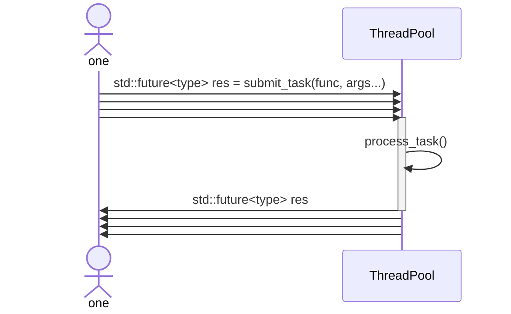

# C++ 通用线程池与并行文件去重工具

本项目包含两个部分：

- `src/threadpool/`：一个基于 C++11 实现的通用线程池组件，支持有界任务队列、异步任务提交、`std::future` 结果获取、优先级调度和可选自动扩缩容。
- `src/dedup/`：一个基于自研线程池实现的并行文件去重命令行工具，用于递归扫描目录并输出重复文件组。

## 构建与测试

```bash
cmake -S . -B build
cmake --build build
ctest --test-dir build --output-on-failure
```

## Benchmark

Benchmark 默认不参与普通构建。需要显式开启：

```bash
cmake -S . -B build-bench -DBUILD_BENCHMARKS=ON -DCMAKE_BUILD_TYPE=Release
cmake --build build-bench
./build-bench/benchmark/dedup/dedupBenchmark --benchmark_min_time=1.0 --benchmark_repetitions=3
```

当前 benchmark 使用 Google Benchmark，直接测量 `DuplicateFinder::find_duplicates()`，不统计命令行进程启动时间。测试数据在 `/tmp` 下临时生成，并比较 `1/2/4/8` 个 hash worker 线程的表现。

当前包含两类 workload：

- many-small-files：`100/1000/10000` 个 4 KiB 文件，用于观察目录扫描、大量 open/close、小文件 hash 和任务调度开销。
- medium-file-hash：`1000` 个 256 KiB 文件，用于观察更明显的 hash 吞吐和多线程读取收益。

Google Benchmark target 会单独使用 C++17 构建；线程池和 dedup 业务代码仍保持 C++11。

详细基线方法和结果记录模板见 [docs/dedup_benchmark.md](docs/dedup_benchmark.md)。

如果需要机器可读输出，可以使用 Google Benchmark 的 JSON 输出：

```bash
./build-bench/benchmark/dedup/dedupBenchmark --benchmark_format=json --benchmark_min_time=1.0 --benchmark_repetitions=3
```

## 并行文件去重工具

`dedup` 是一个只读的文件系统分析工具，当前不会删除文件。它的目标是展示线程池在真实 I/O + CPU 混合任务中的应用：递归扫描目录、过滤不可能重复的文件、并行计算候选文件 hash，并输出重复文件组。

### 使用方式

```bash
./build/src/dedup/dedup /path/to/dir
./build/src/dedup/dedup /path/to/dir --threads 4
```

输出示例：

```text
Duplicate group #1, size=12, count=2
  /tmp/example/a.txt
  /tmp/example/b.txt

Summary:
  scanned files: 3
  hashed files: 3
  threads: 4
  duplicate groups: 1
  errors: 0
```

### 核心流程

```text
FileWalker -> size grouping -> ThreadPool parallel hash -> DuplicateFinder report
```

- `FileWalker`：递归遍历目录，收集普通文件路径和大小，并记录无法访问的路径错误。
- `size grouping`：先按文件大小分组。大小不同的文件必然不是重复文件，因此可以直接跳过唯一大小的文件，避免无意义 hash。
- `ThreadPool parallel hash`：对大小相同的候选文件提交并行 hash 任务。文件 hash 属于 I/O + CPU 混合负载，适合用线程池控制并发度。
- `DuplicateFinder report`：按 `size + hash` 聚合结果，输出重复文件组、扫描数量、hash 数量和错误数量。

`--threads N` 用于显式控制 hash 阶段的并发度。不同机器、磁盘和目录规模下，合适的线程数可能不同；暴露该参数可以避免盲目使用固定并发。

### 当前边界

- 当前使用 FNV-1a 作为 MVP hash 算法，适合演示和工程流程，不是密码学 hash。
- 当前以 `size + hash` 判断重复文件，后续可以增加字节级确认来规避理论上的 hash 碰撞。
- 当前只做扫描和报告，不执行删除、移动等破坏性操作。
- 当前保持 C++11 标准，不依赖 C++17 文件系统库。

## 线程池组件



使用示例详见 [examples/](examples/)，单元测试位于 [test](test) 目录。

### 快速使用

创建线程池后，可以提交任意可调用对象。无显式优先级时，任务默认优先级为 `0`。

```cpp
int initialSize = 3;
wxm::ThreadPool pool(initialSize, 32, false, 1000);

std::future<int> result = pool.submit_task([](int left, int right) {
    return left * right;
}, 6, 7);

std::cout << result.get() << std::endl;
```

也可以提交带优先级的任务。优先级数值越大，越先被调度；同优先级任务按提交顺序 FIFO 调度。

```cpp
std::future<int> highPriorityTask = pool.submit_task(10, []() {
    return 100;
});
```

如果任务内部抛出异常，异常会通过 `future.get()` 传播给调用方。

```cpp
std::future<void> failed = pool.submit_task([]() {
    throw std::runtime_error("task failed");
});

failed.get(); // throws std::runtime_error
```

### 功能特性

- **有界任务队列**：队列满时，提交线程会等待队列释放空间，形成背压。
- **异步任务提交**：支持任意可调用对象，并通过 `std::future` 获取返回值。
- **优先级调度**：任务可指定 `int` 优先级，数值越大越先被调度。
- **同优先级 FIFO**：同优先级任务使用递增入队序号保证提交顺序。
- **优雅析构**：析构时停止接收新任务，并等待已提交任务执行完成。
- **可选自动扩缩容**：可通过构造参数或接口启用/关闭自动扩缩容。
- **多生产者提交**：支持多个外部线程并发调用 `submit_task()`。
- **异常传播**：任务内部异常由 `std::packaged_task` 保存，并在 `future.get()` 时重新抛出。


### 自动扩缩容语义

构造函数参数如下：

```cpp
ThreadPool(int threadCount = 1,
           int queueCapacity = 50,
           bool autoScalingEnabled = false,
           int waitTimeoutMs = 1000);
```

当 `autoScalingEnabled` 为 `true` 时：

- 如果任务队列已满，提交线程等待超过 `waitTimeoutMs` 后，线程池会尝试扩容。
- 如果 worker 在 `waitTimeoutMs` 内没有等到任务，线程池会尝试缩容。
- 线程池最小保留 `1` 个 worker。
- 线程池最大扩展到 `2 * std::thread::hardware_concurrency()`。
- 缩容线程会自然退出并被安全 `join`，不会使用 `detach()`。

自动扩缩容也可以通过接口控制：

```cpp
pool.enable_auto_scaling();
pool.disable_auto_scaling();
```

>[!NOTE]
`waitTimeoutMs` 同时影响扩容和缩容的触发敏感度：值越小，线程池越快响应队列满或 worker 空闲；值越大，线程池越稳定，但扩缩容响应更慢。

## 测试覆盖

当前测试覆盖：

- `dedup` CLI 默认运行、`--threads` 参数和非法参数；
- 文件递归扫描、缺失路径错误收集；
- FNV-1a hash 增量更新；
- 文件 hash 成功、失败和 buffer size 行为；
- 重复文件发现、唯一大小跳过、同大小不同内容过滤；
- 任务执行与空任务异常；
- 优先级调度与同优先级 FIFO；
- 返回值获取与异常传播；
- 任务异常后 worker 继续处理后续任务；
- 有界队列背压；
- 多生产者并发提交；
- 析构时执行完已提交任务；
- 析构时唤醒阻塞提交线程；
- 自动扩容、自动缩容以及开关控制；
- 配置参数合法/非法路径。

## 说明

本项目当前保持 C++11 标准，线程池核心库默认不向 stdout/stderr 打印日志，适合作为上层并行工具的任务调度组件。
